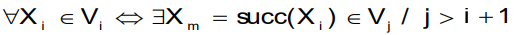
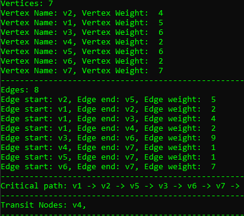

## Дослідження принципів проектування та роботи динамічного та статичного планування
### Теорія
У цій лабораторній роботі представлене програмне забезпечення для знаходження у графі вершин з ознакою явної транзитиності.
Реалізація алгоритму була виконано задопогою мови C#.

Транзитна вершина може належати трьом категоріям: явна транзитність, неявна транзитність та мультиплікативна транзитність.

Явна транзитність - зміна рівня приналежності вершини не збільшує критичний шлях;
Умова визначення вершини "очевидної транзитності":


Використання маркування вершин графу за ознакою транзитності та виконання на його
основі кластеризації дозволяє виконати побудову базового плану рішення з поліпшеними
характеристиками по кількості використовуваних процесорів і їх завантаженості.

### Приклад роботи
```
Graph test = new Graph();
Vertex v1 = new Vertex("v1", 5, 2);
Vertex v2 = new Vertex("v2", 4, 2);
Vertex v3 = new Vertex("v3", 6, 8);
Vertex v4 = new Vertex("v4", 2, 7);
Vertex v5 = new Vertex("v5", 6, 2);
Vertex v6 = new Vertex("v6", 2, 1);
Vertex v7 = new Vertex("v7", 7, 3);
test.AddNode(v2);
test.AddNode(v1);
test.AddNode(v3);
test.AddNode(v4);
test.AddNode(v5);
test.AddNode(v6);
test.AddNode(v7);
test.AddEdge(v1, v2, 2);
test.AddEdge(v1, v3, 4);
test.AddEdge(v1, v4, 2);
test.AddEdge(v2, v5, 5);
test.AddEdge(v3, v6, 9);
test.AddEdge(v4, v7, 1);
test.AddEdge(v5, v7, 1);
test.AddEdge(v6, v7, 7);
```

